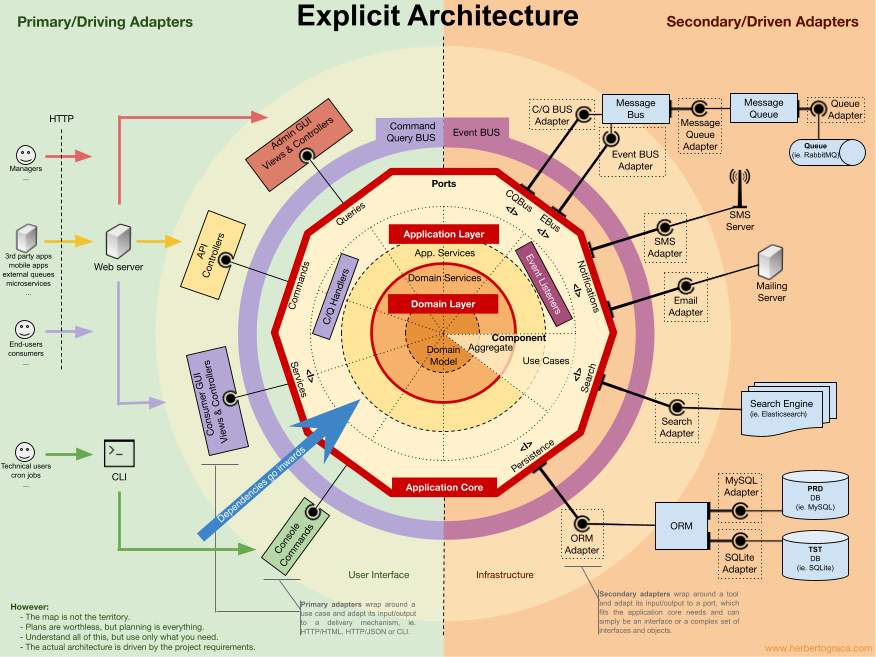

# Hexagonal Architecture (Ports & Adapters) boilerplate

[]()

# **Hexagonal Node API**

> Node.js, TypeScript

## Required global dependencies

- Node.js v16
- Docker Engine v20.10

## Up & Running

1. running on container:

```terminal
docker-compose up
```

## Tree structure

```terminal
├── src
│   ├── core
│   │   ├── adapters
│   │   └── use-cases
│   │   └── entities
│   ├── infrastructure
│   │   ├── adapters
│   │   │   ├── cryptography
│   │   │   └── express
│   │   │   └── postgresql
│   │   └── cryptography
│   │   └── db
│   │   └── notifications
│   │   └── orm
│   │   └── search
│   ├── interface
│   │   ├── adapters
│   │   │   ├── express
│   │   ├── api
│   │   │   ├── rest
│   ├── index.ts
```

| Directory / File             | Description                                                                                                                    |
| ---------------------------- | ------------------------------------------------------------------------------------------------------------------------------ |
| `src`                        | All source code write in TypeScript must be in this directory                                                                  |
| `src/index.ts`               | Main entry point for initial configuration of the project. **Do not edit this file.** Start with `src/index.ts`.               |
| `src/core`                   | Pure domain implementations. `core` directory must **not know** any `port` or `adapter`, nor anything ouside `core` directory. |
| `src/core/adapters`               | Domain adapters. Any `port` that need to talk with some `core` function should pass by an `adapter`.                           |
| `src/core/entities`          | Here you can put your domain entities.                                                                           |
| `src/core/use-cases`         | Here you can put your functions with business rules.                                                                           |
| `src/infrastructure`         | The infrastructure layer, uses various tools (libraries and third-party applications), for example an ORM, a message queue or an SMS provider.                                       |
| `src/infrastructure/adapters`         | Infrastructure adapters. Any `port` that need to talk with some `infra` function should pass by an `adapter.                                       |
| `src/infrastructure/cryptography`         | Here you can put your cryptography providers                              |
| `src/infrastructure/db`         | Here you can put your persistence providers                              |
| `src/infrastructure/notifications`         | Here you can put your notifications providers. Ex: SMS, Email.                            |
| `src/infrastructure/orm`         | Here you can put your orm providers. Ex: Prisma, TypeORM                           |
| `src/infrastructure/search`         | Here you can put your search providers. Ex: Elasticsearch                      |
| `src/interface`         | Containing code that adapts a delivery mechanism to a use case;                    |
| `src/interface/adapters`         | Interface adapters. Any `interface` that need to talk with some `core` function should pass by an `adapter`.                             |
| `src/interface/api`         | Here you can have several APIs for example: Rest, SOAP, GraphQL API. Also you can have several CLI commands for example: Cron, CronTab, Scheduler`.                             |


# **References**

[Hexagonal architecture](https://alistair.cockburn.us/hexagonal-architecture/)

[DDD, Hexagonal, Onion, Clean, CQRS, … How I put it all together](https://herbertograca.com/2017/11/16/explicit-architecture-01-ddd-hexagonal-onion-clean-cqrs-how-i-put-it-all-together/)
